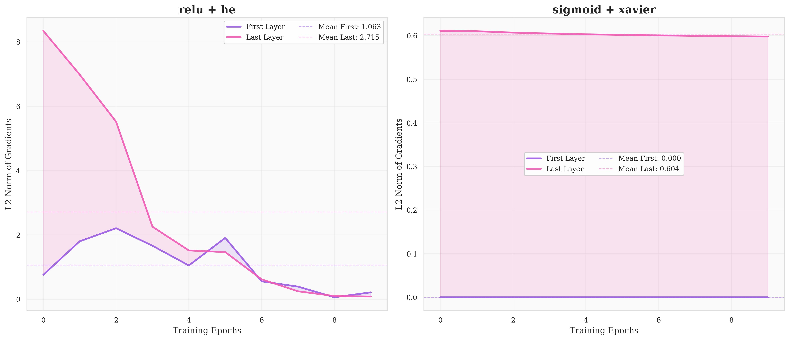

# 🧠

تا اینجا من امدم و دیتاست رو انالیز کردم و اماده کرد بعد یه شبکه عصبی mlp ساختم با numpy و دستی  
در قدم بعدی می رم سروقت 
موضوع اصلی انالیز می کنم و نتیجه گیری نهایی خواهم کرد ✅ 

---

# 🧠 Deep Gradient Dynamics Analysis
### Investigating Vanishing & Exploding Gradients in Deep MLPs

 
 

---

## 📝 Introduction
This repository contains an engineering-grade empirical analysis of **Gradient Flow** within deep neural architectures. The project focuses on the mathematical instability of gradients when scaling network depth, specifically comparing modern and classical optimization techniques.

> **Note:** This implementation is built **from scratch** (Pure NumPy) to ensure architectural transparency and precise tracking of backpropagation chain rules.

---

## 🏗 System Architecture
We utilize a **13-layer Dense Neural Network (MLP)**. This extreme depth is strategically chosen to observe the attenuation or explosion of gradients across the layers.

### 📊 Layer Specifications

| Layer Index | Type         | Input     | Output | Total Parameters |
|------------|-------------|----------|-------|----------------|
| L1         | Dense (Input)| 150,528 | 512   | 77,070,848     |
| L2-L3      | Dense (Hidden)| 512     | 256   | 393,984        |
| L4-L6      | Dense (Hidden)| 256     | 128   | 115,200        |
| L7-L9      | Dense (Hidden)| 128     | 32    | 26,896         |
| L10-L12    | Dense (Hidden)| 32      | 16    | 1,856          |
| L13        | Dense (Output)| 16      | 3     | 51             |

---

## 🧪 Experimental Methodology
We analyze the gradient norm $\|\nabla W\|_2$ across the following permutations:

### ⚡ Activation Functions
- **Sigmoid:** Testing the "Saturation Zone" effect.
- **ReLU:** Analyzing the "Dead ReLU" and gradient propagation efficiency.

### 🛠 Weight Initializations
- **Xavier (Glorot):** Mathematical balancing of variance in Sigmoid layers.
- **He Initialization:** Optimizing the scale for non-linear ReLU activations.

---

## 🚀 Key Insights & Metrics
1. **Gradient Norm per Layer:** How the magnitude of $\frac{\partial L}{\partial W^{(l)}}$ changes as it travels from L13 to L1.  
2. **Weight Distribution:** Monitoring the standard deviation of weights during training.  
3. **Future Roadmap:**
   - [x] MLP Implementation
   - [ ] CNN Architecture Support

---

## 🧠 Dataset & Reference
This analysis uses the **Brain Stroke CT Dataset** from Kaggle:  
[Brain Stroke CT Dataset](https://www.kaggle.com/datasets/ozguraslank/brain-stroke-ct-dataset)

